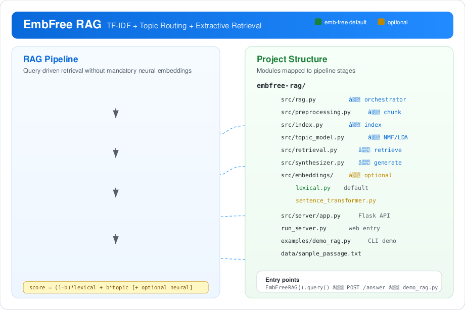

# EmbFree RAG

[](https://www.python.org/downloads/)
[](#)
[](#optional-neural-embeddings)

**Emb-free Retrieval-Augmented Generation for Chinese text** — built on TF-IDF, matrix topic decomposition (NMF/LDA), and extractive answer synthesis.

Repository: [github.com/fooSynaptic/embfree-rag](https://github.com/fooSynaptic/embfree-rag)

<div align="center">
  
</div>

<p align="center"><em>Left: emb-free RAG pipeline · Right: repository modules mapped to each stage</em></p>

## Why emb-free?

| | Emb-free (default) | Neural embedding RAG |
|--|-------------------|----------------------|
| Dependencies | scikit-learn + jieba | + torch + sentence-transformers |
| Hardware | CPU | GPU recommended |
| Interpretability | topic keywords + TF-IDF scores | dense vectors |
| Best for | ASR transcripts, broadcasts, dialogue logs | semantic similarity queries |

Open-source embedding models are supported as an **optional adapter**, not a hard requirement.

## Quick start

```bash
git clone https://github.com/fooSynaptic/embfree-rag.git
cd embfree-rag
pip install -r requirements.txt
python examples/demo_rag.py --question "找不到喜欢的人怎么办？"
```

Web UI:

```bash
python run_server.py
# open http://127.0.0.1:5000
```

## Python API

```python
from src.rag import EmbFreeRAG

pipeline = EmbFreeRAG()
result = pipeline.query(
    passage=open("data/sample_passage.txt", encoding="utf-8").read(),
    question="这段对话主要在讨论什么？",
)

print(result.answer)
print(result.context)
print(result.metrics)
```

## Architecture


Details: [architecture.md](architecture.md)

## Project structure

```text
embfree-rag/
├── src/
│   ├── index.py
│   ├── retrieval.py
│   ├── rag.py
│   ├── synthesizer.py
│   ├── topic_model.py
│   └── embeddings/
├── examples/demo_rag.py
├── run_server.py
├── data/sample_passage.txt
└── docs/architecture.md
```

## Optional neural embeddings

```bash
pip install -r requirements-embeddings.txt
```

```python
from src.config import embedding_config
from src.rag import EmbFreeRAG

embedding_config.backend = "sentence-transformers"
embedding_config.model_name = "BAAI/bge-small-zh-v1.5"
embedding_config.hybrid_alpha = 0.7

pipeline = EmbFreeRAG()
```

## HTTP API

```bash
curl -X POST http://127.0.0.1:5000/answer \
  -H "Content-Type: application/json" \
  -d '{"passage":"...", "question":"..."}'
```

## License

MIT License
