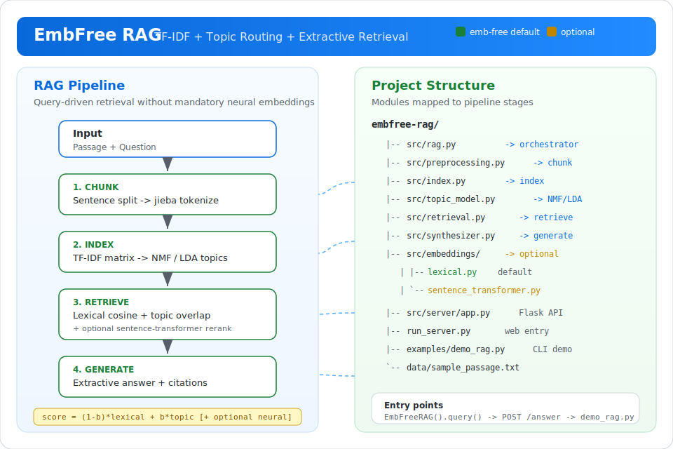

# Emb-free RAG Architecture

## Positioning

This project is **RAG without mandatory neural embeddings**:

| Layer | Default (emb-free) | Optional |
|-------|-------------------|----------|
| Chunking | sentence split | same |
| Index | TF-IDF | same |
| Topic routing | NMF / LDA | same |
| Retrieval | lexical cosine + topic overlap | + sentence-transformers |
| Generation | extractive citations | (future: LLM) |

Neural embedding models are **optional adapters**, not core dependencies.



## Pipeline

```text
Passage + Question
      |
      v
[1] Sentence chunking (。！？)
      |
      v
[2] jieba tokenization + TF-IDF matrix
      |
      v
[3] NMF topic decomposition  --> topic keywords per chunk
      |
      v
[4] Hybrid retrieval score:
      (1 - topic_boost) * lexical + topic_boost * topic_overlap
      [+ optional neural cosine when backend != lexical]
      |
      v
[5] Extractive answer + ordered citations
```

## Why emb-free?

- Works on CPU with scikit-learn only
- Interpretable topic keywords
- Good for ASR / broadcast / dialogue transcripts
- No model download, no GPU, no API keys

## Optional embeddings

Install `requirements-embeddings.txt` and set:

```python
from src.config import embedding_config
embedding_config.backend = "sentence-transformers"
```

Then retrieval becomes a hybrid of lexical + neural scores.
